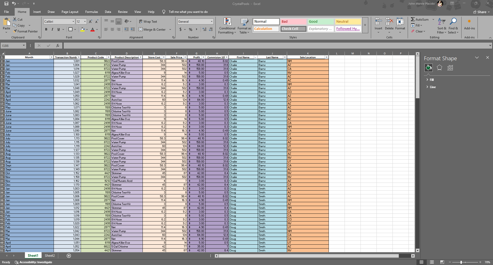
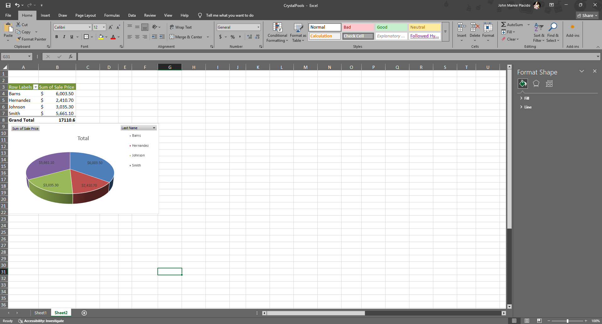

📊 Sales Database (172 lines)
A lightweight sales tracking project built with Excel formulas and visualization tools. This project demonstrates how to manage and analyze sales data efficiently using core spreadsheet functions.

🔑 Features

- Text to Columns – organize raw sales entries into structured fields

- IF / SUMIF – apply conditional logic and calculate category-based totals

- SORT / FILTER – manage and display data dynamically

- Pivot Tables – summarize large datasets into key insights

- Pie Chart – visualize sales distribution

🚀 Purpose

Designed as a practice project to strengthen data analysis skills while keeping the solution simple, clean, and beginner-friendly.

*Main sales database with formulas applied.*

*Pivot table summary and pie chart visualization.*
